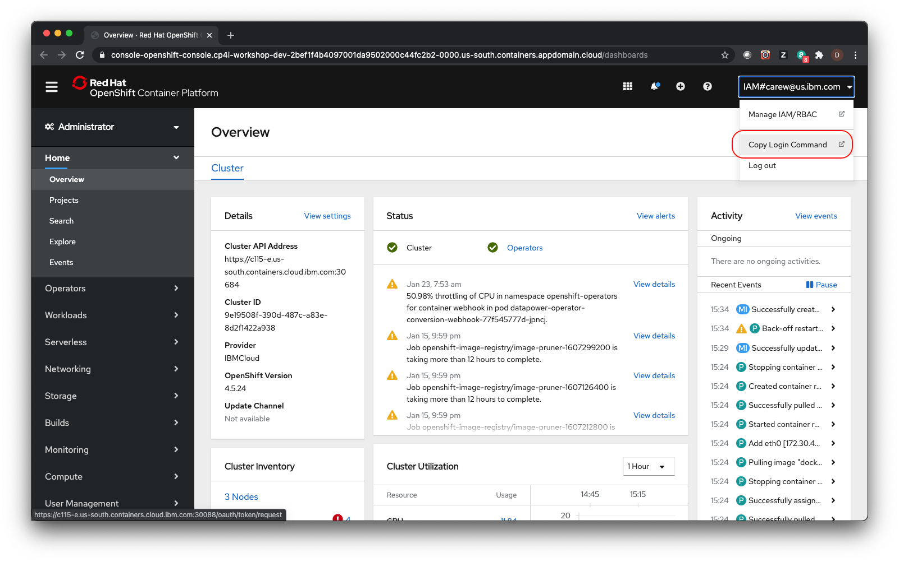
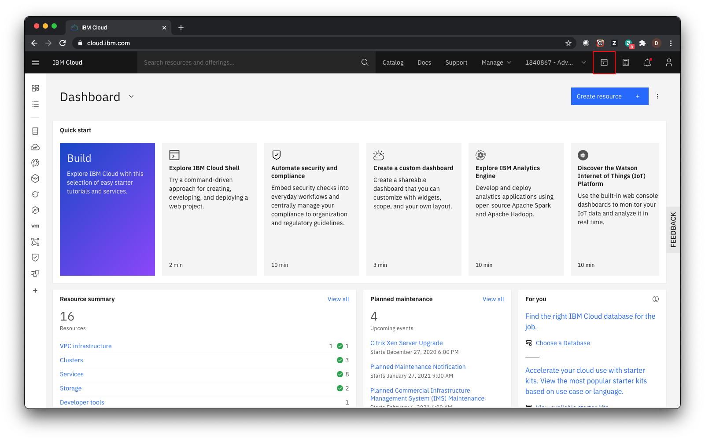

# Setup

## Access the assigned cluster via the IBM Cloud Shell web terminal

1. In a separate browser tab go to the OpenShift console of the cluster assigned to you.

2. Click on your username in the upper right and select **Copy Login Command**

  

3. Click the **Display Token** link.

4. Copy the contents of the field **Log in with this token** to the clipboard. It provides a login command with a valid token for your username.

5. In a separate browser tab go to the IBM Cloud URL [https://cloud.ibm.com] (https://cloud.ibm.com) and log in with your ibm.com credentials.

6. Click the icon for the IBM Cloud Shell terminal to launch it

  

7. Paste the *oc login* command in the IBM Cloud Shell terminal and run it
